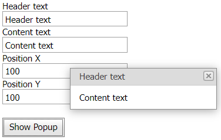

# Popup Control for ASP.NET Web Forms - How to customize a pop-up window's content and layout
<!-- run online -->
**[[Run Online]](https://codecentral.devexpress.com/e3049/)**
<!-- run online end -->

This example demonstrates how to use the control's client-side funstionality to specify a pop-up window's position and content.



## Overview

Use the following client-side methods:

* [SetContentHtml](https://docs.devexpress.com/AspNet/js-ASPxClientPopupControlBase.SetContentHtml(html)) - specifies the window's content.
* [SetHeaderText](https://docs.devexpress.com/AspNet/js-ASPxClientPopupControlBase.SetHeaderText(value)) - specifies the text of the window's header.
* [ShowAtPos](https://docs.devexpress.com/AspNet/js-ASPxClientPopupControlBase.ShowAtPos(x-y)) - specifies the window's position.

```js
function ShowPopup(headerText, contentText, positionX, positionY) {
    popup.SetHeaderText(headerText);
    popup.SetContentHtml(contentText);
    popup.ShowAtPos(positionX, positionY);
}
```

## Files to Review

* [Default.aspx](./CS/WebSite/Default.aspx) (VB: [Default.aspx](./VB/WebSite/Default.aspx))

## Documentation

* [Popup Control](https://docs.devexpress.com/AspNet/3582/components/docking-and-popups/popup-control)
